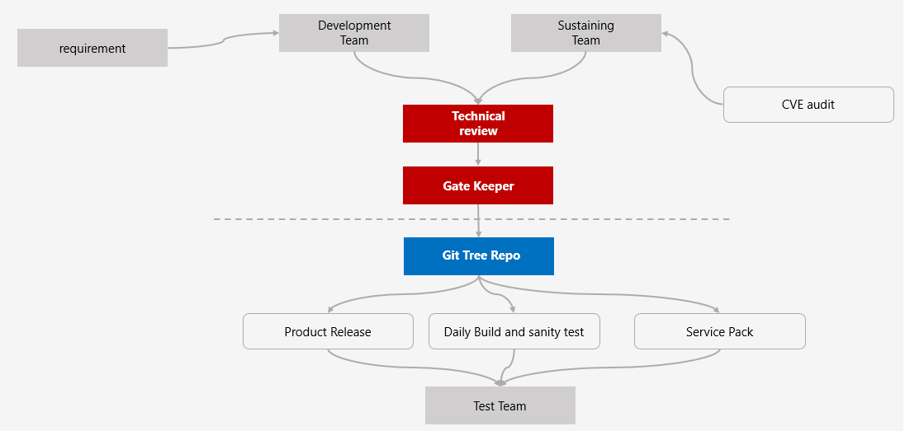

# 软件开发模式

这里讲一下微观上的开发流程，因为无论多么宏伟的规划，实际上的工程是一行一行的代码敲出来的（当然也有粘贴复制而来的）。工程实践上的偏差会毁掉所有的构思。很多的时候够呛是廉价的，工程实践是无价的。 

如果要描述的话，写程序是一个奇妙的过程，奇妙的地方在于
- 看似流程严谨，实则千疮百孔
- 千军万马写代码，仔细一看全是毕业生
- 有些外部公司极端重要的岗位，往往缺失了；

更奇妙的地方在于，虽然千疮百孔，但是有的公司却征服了世界；存在即合理；背后的逻辑很难理解；

站在一线的角度来衡量研发体系和流程是不是完善，合理，高效可以从三个基础标准来衡量：
1. 在任何时候，从现网中随机抽取一个软件版本，还能不能找到与之对应的全部的源代码；
2. 在任何时候，在代码仓库的任何一个commit，是不是都有明确的bug ID和需求ID对应(是休整一个bug还是完成了一个feature)
3. 开发工位是不是安安静静的。

1和2是软件质量的最基础的工作，3是在基本质量的前提下，如何把关键质量做的更好。

1和2其实是一个问题的两个方向：代码和业务必须有明确的对应关系，他们之间具有明确的可回溯性。

一般来说一个release的版本从实体上表现为一个交付件，里面包含了非常多的安装件和程序题。但是在代码层面，则表现为一个git库中的波浪线，。

所谓能否把现网运行的某一个版本的所有源代码找全，是指你是否能在git库中找到对应的那个版本线，那根软件世界中最重要的线；

判断这根线有效的三个依据：
- 软件名称
- 软件版本
- git库的布局

有了这三个最基本的组织形式，才能做到现网的任何release可以在代码库中做到可回溯，而可回溯是软件质量最重要的属性，没有之一。代码都找不到，找不全了，还谈质量，不是很搞笑吗？

指标2，则是可回溯性的另外一个体现，它的目标也是非常清晰和简洁的，git库中的任何一个commit必须是有来源的。为什么要设定这个目标？实际上是和git的工具体系有关系的。

## git - 不仅仅是代码仓库

软件的本质是信息的几何体，但是信息绝对不是只有可执行程序。举个例子，一个程序安装到哪个软件路径就是一种信息，这种信息不是代码，但是在一定程度上比代码本身还重要。软件包是CI工具做出来的，这种路径信息放在了哪里？显然也是存放在git仓库中；
git本身实际上承担了软件所有数字化信息的存储工具。

因此，git不光是一个代码仓库，更是各种信息的保存库，更是一个协作平台，还是软件版本管理工具。

西方社会对“工具”这个层面具有非常高的认可度，没有人认为开发一个好用的工具是一个低档次的工作。他们对自动化，工具化的认同是深入骨髓的。他们会不断打磨手里面的工具。

既然git是软件所有细心的存储地，那么也就意味着，如果git中出现了任何错误信息，那么这种错误信息就会随着CI系统，随着构建系统发布出去，最后到了客户手里。因此对于软件质量控制的第一个核心关键点就是：

- 任何进入git的信息都需要有明确的来源，并且有相应的原因和理由。

这个基本要求很大程度上也和安全可信是强相关的。要做到系统安全，第一要素不在于加装了多少层的安全防护机制，而在于保证系统内的所有部件有明确可信的来源。一个系统上运行的部件都不知道从哪里来的，安全还能是靠谱的吗？

还有一个维度说明git里信息的干净程度的重要性，那就是测试，一般来说，软件测试团队的工作流程是在CI从git库中取出代码构建成为系统后进行测试。通常这种测试只能做到功能层面的测试，几乎不可能要求测试团队能找到系统中的大多数bug。因此整个测试团队的定位更多是验证式测试。而非“找到尽可能多的bug”。

事实上，一旦有问题的信息，无论是代码也好，还是其他方面的有害信息进入到git，整个软件质量基本上就很难控制了。因此git的数据随着时间的增加呈现指数增长，找到问题会越来越难。

所以

**软件质量上的把控重点是信息入库前，而不是信息入库后，更不是苛责测试团队把所有问题找出来**

## 开发“黑科技”

硅谷公司WR的研发流程：

1. 研发团队有两个，一个是dev团队，一个是sustaining团队。一个主要负责特性开发，一个主要是负责问题的修复，安全修复等。一个负责2.0,3.0,4.0等基础版本的开发。一个负责2.x, 3.x, 4.x等后续版本的开发。
2. 所有的开发内容需要进过tech review，一般分为两层。
- 一层是特性review，比如网络的patch就发给网络的技术负责人进行review， ARM架构相关的patch就发给ARM相关的技术负责人review。

